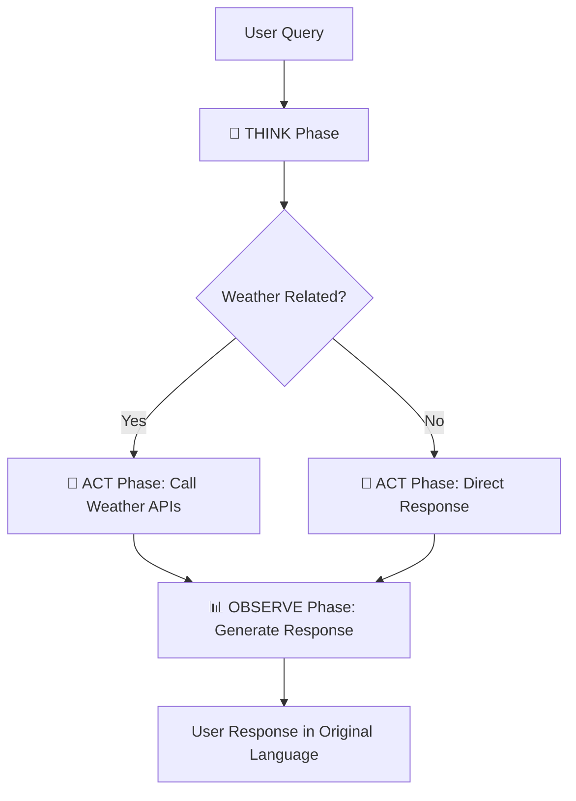

# 🌤️ Weather Agent

An intelligent weather assistant that understands natural language queries and provides smart responses using live weather data. Built with modern Python and AI, it demonstrates advanced agent architecture, API integration, and cloud deployment practices.

### Key Features
- 🧠 **Intelligent Agent Architecture**: Advanced reasoning system inspired by Thought-Action-Observation patterns
- 🌍 **Live Weather Data**: Real-time weather information from OpenWeatherMap API
- 📅 **Calendar Integration**: Weather-aware calendar recommendations and event analysis
- 🚀 **Modern Architecture**: FastAPI with async support, automatic OpenAPI docs
- ☁️ **Cloud Deployment**: Production-ready deployment on Google Cloud Run
- 🔒 **Enterprise Security**: Google Secret Manager for secure API key management
- 🧪 **Comprehensive Testing**: Complete test coverage with pytest and async testing
- 🌐 **Multilingual Support**: Detects language and responds in user's original language
- 🎯 **Smart Tool Calling**: Only calls weather APIs when actually needed

### Example Queries
- *"What's the weather in New York?"* → Gets current weather data
- *"Should I bring an umbrella to my meeting in SF tomorrow?"* → Analyzes forecast + provides advice
- *"¿Lloverá mañana en Madrid?"* → Responds in Spanish with Madrid forecast
- *"Hello, how are you?"* → Responds conversationally without weather API calls
- *"Check my outdoor events for weather risks"* → Integrates calendar + weather data

## 🧠 Intelligent Agent Architecture

### Agent Decision-Making Process

The weather agent uses an intelligent reasoning system inspired by the **Thought-Action-Observation** pattern:



#### 🤔 **THINK Phase**: Query Analysis & Planning
```python
# The agent analyzes each query to determine:
- Is this weather-related? (prevents unnecessary API calls)
- What language is the user speaking? (for proper response)
- What specific weather data is needed? (current vs forecast)
- What location and timeframe? (parsing context)
- What type of response would be most helpful?
```

#### 🎯 **ACT Phase**: Smart Tool Execution
```python
# Based on analysis, the agent decides which actions to take:
- Weather queries → Call OpenWeatherMap APIs
- Non-weather queries → Skip API calls entirely
- Calendar queries → Integrate calendar + weather data
- Complex queries → Multiple coordinated API calls
```

#### 📊 **OBSERVE Phase**: Intelligent Response Generation
```python
# The agent crafts responses that:
- Match the user's original language
- Provide actionable insights (not just raw data)
- Combine multiple data sources when relevant
- Handle errors gracefully with helpful alternatives
```

### Key Agent Capabilities

| Capability | Example | Technical Implementation |
|------------|---------|-------------------------|
| **Language Detection** | "¿Hace calor?" → Spanish response | GPT-4 analysis + response matching |
| **Smart API Calling** | "Hello" → No weather API calls | Reasoning prevents unnecessary requests |
| **Context Understanding** | "Umbrella needed?" → Checks rain forecast | Advanced query parsing + weather analysis |
| **Calendar Integration** | "Weather for my events" → Combines data sources | Calendar API + weather correlation |
| **Error Handling** | API down → Provides helpful fallback | Multiple fallback strategies |

## 🏗️ Architecture & Tech Stack

### Core Technologies
- **Python 3.11+**: Modern Python with async/await support
- **FastAPI**: High-performance web framework with automatic OpenAPI docs
- **OpenAI GPT-4**: Advanced natural language understanding and reasoning
- **OpenWeatherMap API**: Reliable, global weather data source
- **UV**: Modern, fast Python dependency management
- **pytest**: Comprehensive testing framework
- **Google Cloud Run**: Serverless container deployment
- **Google Secret Manager**: Secure API key management

### 🎯 Key Product Decisions

#### **Why Intelligent Agent over Simple Weather Lookup?**
- **User Experience**: Understands complex queries like "Should I bring a jacket?"
- **Efficiency**: Only calls APIs when actually needed (saves costs + latency)
- **Multilingual**: Responds in user's original language automatically
- **Context-Aware**: Combines weather with calendar events for smart recommendations
- **Extensible**: Easy to add new capabilities (traffic, news, etc.)

#### **Why OpenWeatherMap over weather.com?**
- **API Quality**: Clean, well-documented RESTful APIs
- **Reliability**: 99.9% uptime SLA vs weather.com's variable availability
- **Global Coverage**: Superior international location support
- **Rate Limits**: Generous free tier (1000 calls/day) for development
- **Data Accuracy**: Equivalent accuracy with better structured responses

#### **Why FastAPI + Web Interface?**
- **Developer Experience**: Auto-generated OpenAPI docs for easy testing
- **Multiple Interfaces**: API-first design enables CLI, web, bot integrations
- **Production Ready**: Built-in async support for high performance
- **Type Safety**: Excellent Pydantic integration for request validation
- **Enterprise Adoption**: Easy to integrate into existing systems

### Architecture Decisions

**Why GPT-4 for Agent Reasoning?**
- Superior reasoning capabilities for complex query analysis
- Excellent multilingual support for global users
- Robust handling of edge cases and ambiguous queries
- Consistent performance for production workloads

**Why UV for dependency management?**
- 10-100x faster than pip for dependency resolution
- Modern approach built in Rust for reliability
- Single tool for all Python package operations
- Growing industry adoption and active development

**Why Google Cloud Run?**
- Serverless containers with enterprise reliability
- Pay-per-use pricing model (cost-effective)
- Fast cold starts (<1 second) for good UX
- Seamless integration with Secret Manager and other GCP services

## 🚀 Quick Start

### Prerequisites
- Python 3.11+
- UV package manager
- Google Cloud CLI (for deployment)
- Required API keys:
  - OpenAI API key
  - OpenWeatherMap API key

### Local Development Setup

1. **Clone the repository**
   ```bash
   git clone https://github.com/leo8/weather-agent.git
   cd weather-agent
   ```

2. **Install dependencies**
   ```bash
   # Install UV if not already installed
   curl -LsSf https://astral.sh/uv/install.sh | sh
   
   # Install project dependencies
   uv sync
   ```

3. **Environment configuration**
   ```bash
   # Copy environment template
   cp .env.example .env
   
   # Edit .env with your API keys
   nano .env
   ```

   Required environment variables:
   ```env
   OPENAI_API_KEY=sk-your-openai-key-here
   OPENWEATHER_API_KEY=your-openweather-key-here
   ENVIRONMENT=development
   LOG_LEVEL=INFO
   ```

4. **Run the application**
   ```bash
   uv run uvicorn app.main:app --reload --host 0.0.0.0 --port 8000
   ```

5. **Access the application**
   - **Web Interface**: http://localhost:8000 (for easy testing)
   - **API Documentation**: http://localhost:8000/docs (interactive Swagger UI)
   - **Health Check**: http://localhost:8000/health (system status)

## 📖 API Documentation

### Core Endpoints

#### Natural Language Query (Main Endpoint)
```http
POST /query/
Content-Type: application/json

{
  "query": "What's the weather like in Paris tomorrow?",
  "user_id": "optional-user-id",
  "session_id": "optional-session-id"
}
```

**Response:**
```json
{
  "parsed_query": {
    "location": "Paris",
    "query_type": "forecast",
    "confidence": 0.95
  },
  "weather_data": {
    "location": "Paris, FR",
    "forecast": [...],
    "data_type": "Forecast"
  },
  "natural_response": "Tomorrow in Paris will be partly cloudy with a high of 18°C. Perfect weather for outdoor activities!",
  "processing_time_ms": 1250
}
```

#### Agent Debugging Endpoint
```http
POST /query/test-agent
Content-Type: application/json

{
  "query": "Should I bring an umbrella?"
}
```

**Shows internal reasoning:**
```json
{
  "query": "Should I bring an umbrella?",
  "agent_trace": {
    "thought": {
      "is_weather_related": true,
      "detected_language": "en",
      "reasoning": "User asking about umbrella suggests rain concern",
      "suggested_actions": ["get_weather_forecast"]
    },
    "actions": [
      {
        "type": "get_weather_forecast",
        "success": true,
        "has_data": true
      }
    ],
    "observation": {
      "final_response": "Based on the forecast...",
      "language": "en",
      "confidence": 0.9
    }
  }
}
```

#### Direct Weather Endpoints
```http
GET /weather/current/{location}
GET /weather/forecast/{location}?days=5
POST /weather/query
```

#### Calendar Integration
```http
POST /calendar/weather-check
Content-Type: application/json

{
  "query": "Weather risks for my outdoor events this week",
  "date_range": "next 7 days"
}
```

**Response includes:**
- Calendar events analysis
- Weather-based recommendations
- Risk assessments for outdoor activities

## 🧪 Testing

### Run Tests
```bash
# Run all tests
uv run pytest

# Run with coverage
uv run pytest --cov=app --cov-report=html

# Test specific components
uv run pytest tests/test_agent.py -v          # Agent reasoning tests
uv run pytest tests/test_integration.py -v   # End-to-end tests
uv run pytest tests/test_weather_api.py -v   # Weather API tests

# Test multilingual support
uv run pytest -k "multilingual" -v
```

### Test Coverage
- **Agent Tests**: Reasoning, language detection, action selection
- **Integration Tests**: Full query → response workflows
- **API Tests**: Individual service endpoints
- **Error Handling**: Network failures, invalid inputs, API limits
- **Multilingual Tests**: Spanish, French, English responses

## 📊 Observability & Monitoring

### Logging Architecture
```python
# Development: Human-readable logs with emojis
2024-01-15 10:30:15 | INFO | 🤔 THINK: Analyzing query "Weather in Paris"
2024-01-15 10:30:15 | INFO | 🎯 ACT: Calling weather API for Paris
2024-01-15 10:30:16 | INFO | 📊 OBSERVE: Generated response in English

# Production: Structured JSON logs
{
  "timestamp": "2024-01-15T10:30:15Z",
  "level": "INFO", 
  "phase": "THINK",
  "request_id": "req_123",
  "message": "Query analysis complete",
  "metadata": {
    "is_weather_related": true,
    "detected_language": "en",
    "processing_time_ms": 245
  }
}
```

### Health Checks
- `/health` - Overall system status
- `/query/health` - Agent + NLP services
- `/weather/health` - Weather API status
- `/calendar/health` - Calendar integration status

## 🚀 Deployment

### Google Cloud Run Deployment

#### 1. Prerequisites Setup
```bash
# Set project variables
export GOOGLE_CLOUD_PROJECT="your-project-id"
export GOOGLE_CLOUD_REGION="us-central1"

# Authenticate with Google Cloud
gcloud auth login
gcloud config set project $GOOGLE_CLOUD_PROJECT

# Enable required APIs
gcloud services enable cloudbuild.googleapis.com
gcloud services enable run.googleapis.com
gcloud services enable secretmanager.googleapis.com
```

#### 2. Create Secrets
```bash
# Store API keys in Secret Manager
echo "your-openai-key" | gcloud secrets create openai-api-key --data-file=-
echo "your-openweather-key" | gcloud secrets create openweather-api-key --data-file=-

# Verify secrets
gcloud secrets list
```

#### 3. Deploy Application
```bash
# Using the deployment script
./deploy.sh

# Or manual deployment
gcloud builds submit --config cloudbuild.yaml
```

### CI/CD Pipeline Setup

#### 1. Infrastructure Setup
```bash
# Set GitHub repository information
export GITHUB_REPO_OWNER="your-username"
export GITHUB_REPO_NAME="weather-agent"

# Run automated setup
./setup-cicd.sh
```

#### 2. GitHub Secrets Configuration

Add these secrets to your GitHub repository (Settings → Secrets and variables → Actions):

- `GCP_PROJECT_ID`: Your Google Cloud Project ID
- `GCP_SA_KEY`: Service account key JSON (generated by setup script)
- `OPENAI_API_KEY`: Your OpenAI API key
- `OPENWEATHER_API_KEY`: Your OpenWeatherMap API key

#### 3. Deployment Workflow

```bash
# Feature development
git checkout -b feature/new-feature
git commit -m "Add new feature"
git push origin feature/new-feature
# → Triggers tests only

# Production deployment
git checkout main
git merge feature/new-feature
git push origin main
# → Triggers tests + deployment to production
```

## 📂 Project Structure

```
weather-agent/
├── app/                          # Main application
│   ├── main.py                   # FastAPI application entry point
│   ├── models/                   # Pydantic data models
│   │   ├── weather.py           # Weather-related models
│   │   └── nlp.py               # NLP request/response models
│   ├── routers/                  # API route handlers
│   │   ├── weather.py           # Direct weather endpoints
│   │   ├── nlp.py               # Intelligent agent endpoints
│   │   └── calendar.py          # Calendar integration
│   ├── services/                 # Business logic
│   │   ├── agent_service.py     # 🧠 Core intelligent agent
│   │   ├── weather_service.py   # Weather API integration
│   │   └── calendar_service.py  # Google Calendar utilities
│   └── utils/                    # Utility functions
├── tests/                        # Test suite
│   ├── test_agent.py            # Agent reasoning tests
│   ├── test_nlp_api.py          # NLP endpoint tests  
│   ├── test_weather_api.py      # Weather API tests
│   ├── test_calendar_api.py     # Calendar integration tests
│   └── test_integration.py      # End-to-end tests
├── frontend/                     # Web interface
│   ├── index.html               # Main web page
│   ├── style.css                # Styling
│   └── script.js                # Frontend logic
├── .github/                      # GitHub Actions workflows
│   └── workflows/
│       └── deploy.yml           # CI/CD pipeline
├── Dockerfile                    # Container configuration
├── cloudbuild.yaml              # Google Cloud Build config
├── pyproject.toml               # Python project configuration
├── uv.lock                      # Dependency lock file
└── README.md                    # This file
```

## 🏆 Key Achievements

- **Intelligent Decision Making**: Agent only calls weather APIs when needed, saving costs and improving response times
- **Multilingual Support**: Automatically detects and responds in user's original language
- **Production Ready**: Full observability, error handling, and deployment pipeline
- **Extensible Architecture**: Easy to add new tools and capabilities
- **Enterprise Quality**: Comprehensive testing, security, and monitoring

## 🔮 Future Enhancements

- **Enhanced Calendar Integration**: Real Google Calendar API with OAuth
- **More Data Sources**: Traffic, air quality, UV index, pollen counts
- **Advanced Scheduling**: AI-powered meeting time suggestions based on weather
- **Mobile App**: React Native or Flutter mobile interface
- **Voice Interface**: Speech-to-text and text-to-speech capabilities
